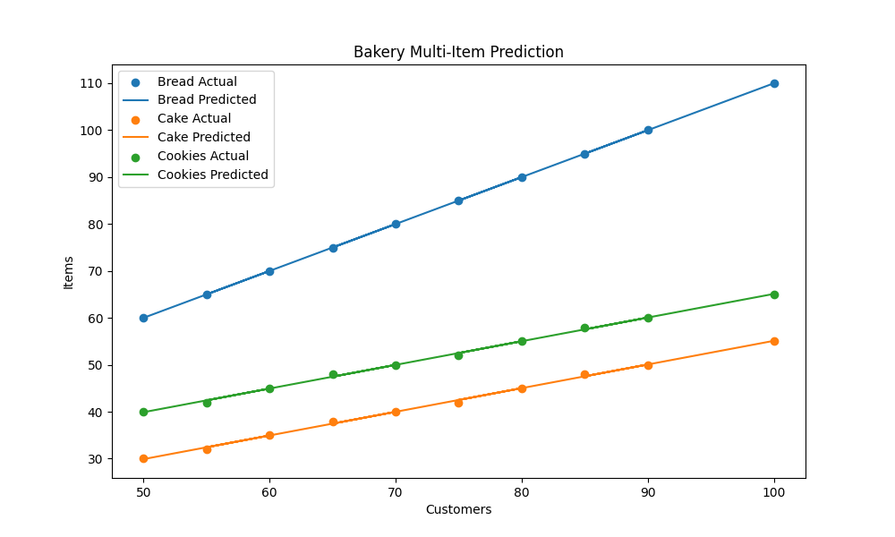

#  Bakery Demand Prediction System 

## 📌 Problem
Predict quantity of multiple bakery items based on number of customers.

## 🧠 Algorithm Used
Linear Regression (Multi-output)

## 📂 Dataset
- Customers
- Bread
- Cake
- Cookies

## ⚙️ Tools Used
- Python
- Pandas
- Matplotlib
- Scikit-learn

## 📈 Output
- Prediction graph (output.png)
- Residual graph (bread_residual.png)

## 🔍 Sample Prediction
For 85 customers:
- Bread ≈ predicted value
- Cake ≈ predicted value
- Cookies ≈ predicted value

- ## 📸 Output Graph

## 🎯 Conclusion
This system helps bakeries decide how much to produce, reducing waste and improving efficiency.
